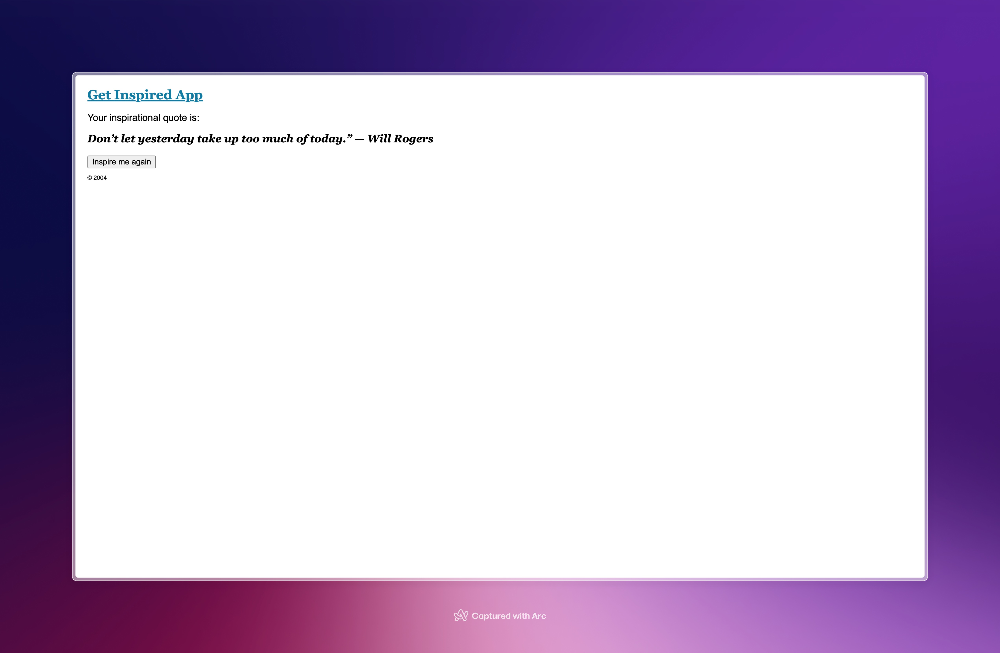

### The goal of the code is to understand how React treats UI as a tree 

#### Goal(from React docs):

[Goal as a screen recording](src/assets/Goal%20SR.mov)

#### Achievement(replicated from scratch):

[Achievement as a screen recording](src/assets/Achievement%20SR.mov)

We can see both are same. Hence, the goal is achieved. 